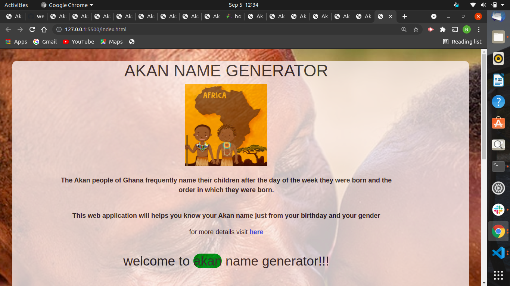
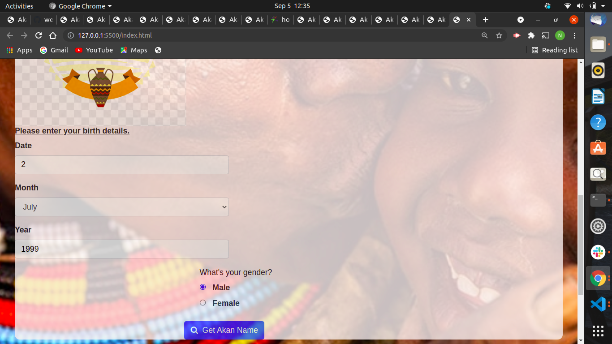
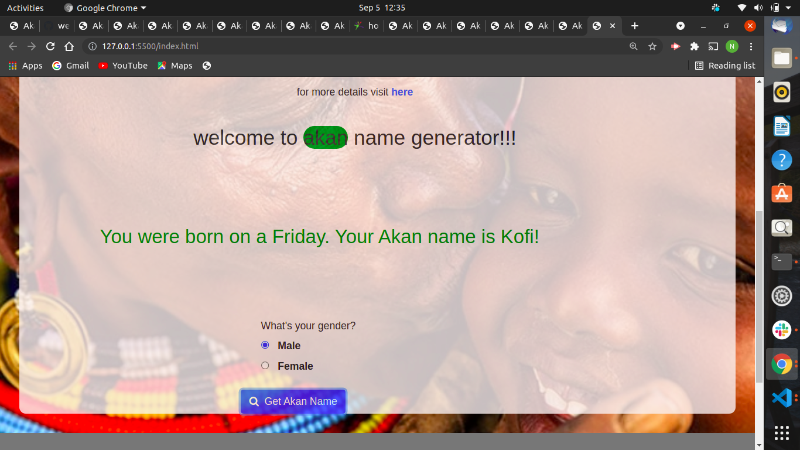

# week 2 project
 moringa school
## APPLICATION NAME.
 AKAN NAMES of GHANA PEOPLE

 ## application description
This are name given to akan-people who live in ghana .

the Akan people of Ghana frequently name their children after
the day of the week they were born and the order in which they were born.

 
  
 

 

## NAMES OF AUTHOR
*1.Nur Nure Tusa*

# Setup/Installation Requirements

1. Clone the project using git -clone . If you are not able to clone it, you can download the files as a zip folder

2. Ensure that you have the complete file

3. Navigate to the index.html file which is in the root file of the folder. The application is static and only uses HTML and CSS 

4. Copy the path of the index.html file to your browser and you will be able to access the application.

# description of the project purpose
This is a project that shows portfolio landing page and biography

# live link of the website
 https://nur-tusa.github.io/prep-week2/

## BUilt with
*1.html*

*2.css*

*3. java script*

*4. bootstrap*

## support team for more information .
*NAME - nur tusa*.
*EMAIL - nur.tusa@student.moringaschool.com*.
*CONTACT - +254115314390*. 
*ADDRESS - NAIROBI KENYA *.

#### licence information with a copyright & date

2021 Copyright All Rights Reserved To tusa company

